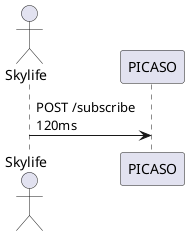

# 📡 PICASO 로그 기반 시퀀스 다이어그램 자동 생성 시스템

[Azure Web 바로가기](https://pro-lhn-webapp.azurewebsites.net/)

## 1. 개요

- **목적**: PICASO 시스템의 로그 데이터를 기반으로 트랜잭션 흐름을 자동 분석하고 시퀀스 다이어그램으로 시각화
- **활용 사례**:
  - 장애 분석 시 호출 흐름 파악
  - 외부 연동 구조 이해
  - 테스트/QA 단계에서 트랜잭션 검증

---

## 2. 아키텍처 구성

```plaintext
[사용자]
   │
   ▼
[Streamlit UI]
   │
   ▼
[로그 업로드 및 트랜잭션 선택]
   │
   ▼
[LLM 기반 분석 파이프라인]
   ├─ Parse 단계 (로그 → 추론된 step JSON)
   └─ Generate 단계 (step JSON → PlantUML 코드)
   │
   ▼
[PlantUML 서버 렌더링]
   │
   ▼
[시퀀스 다이어그램 시각화]
```

---

## 3. 주요 컴포넌트 설명

### 🖥️ Streamlit UI

- 사용자 인터페이스
- 로그 파일 업로드 및 트랜잭션 선택
- 결과 시각화 및 PlantUML 링크 제공

### 🧠 LLM 기반 분석 파이프라인

#### 1. Parse 단계

- 로그를 기반으로 트랜잭션 흐름 추론
- IN-REQ, OUT-REQ, OUT-RES, IN-RES 단계 구성
- 누락된 단계는 `"MISSING"`으로 보완

#### 2. Generate 단계

- 추론된 step을 기반으로 PlantUML 시퀀스 다이어그램 생성
- latency, status, actor/target 정보 포함

### 🔗 Azure OpenAI API

- Azure 기반 GPT 모델 활용
- 시스템 프롬프트를 통해 출력 형식 강제 (JSON / PlantUML)

### 🖼️ PlantUML 서버

- 생성된 PlantUML 코드를 SVG로 렌더링
- 외부 링크로 시퀀스 다이어그램 확인 가능

---

## 4. 기술 스택

| 구성 요소     | 기술/도구                     |
|--------------|-------------------------------|
| UI           | Streamlit                     |
| LLM          | Azure OpenAI (GPT 기반)       |
| 시각화       | PlantUML (SVG 렌더링 서버)    |
| 환경 설정    | dotenv (.env)                 |
| 데이터 처리  | Python (json, base64 등)      |

---

## 5. End-to-End 실행 흐름

1. 사용자 로그 업로드
2. 트랜잭션 선택
3. Parse 프롬프트 생성 → LLM 호출 → step JSON 추출
4. Generate 프롬프트 생성 → LLM 호출 → PlantUML 코드 생성
5. PlantUML 서버로 렌더링 → 시퀀스 다이어그램 시각화

---

## 6. 출력 예시



---

## 7. 시스템의 장점

- ✅ **자동화**: 복잡한 로그 분석을 LLM이 자동 수행
- ✅ **표준화**: 일관된 시퀀스 다이어그램 포맷 유지
- ✅ **확장성**: 다양한 로그 포맷에 적용 가능
- ✅ **가시성 향상**: 호출 흐름을 시각적으로 표현하여 이해도 향상

---

## 8. 향후 발전 방향

- 🧠 LLM fine-tuning 통한 정확도 향상 
  - RAG 통한 Refine 기능 추가 (API 매핑 정확도 향상, 계약ID기반 흐름 추적)
- 📦 다양한 로그 포맷 지원 (Kafka, DB 트레이스 등)
- 🧩 다중 트랜잭션 병렬 분석 기능
- 📊 시각화 UI 고도화 (다이어그램 내 필터링, 인터랙션)

---

[Azure Web 바로가기](https://pro-lhn-webapp.azurewebsites.net/)


## 기타

<details>
<summary>설계 변경</summary>

<!-- summary 아래 한칸 공백 두어야함 -->
### Refine 기능 제외
초기 설계 시 3단계로 파이프 라인을 설계하였으나,  중간 단계인 Refine 에 예상소요 시간이 길어 우선 1,3 단계로 진행함   
** Refine 단계 : API 기능 설명이나 에러코드 등을 보완

```
[LLM 기반 분석 파이프라인]
   ├─ Parse 단계 (로그 → 추론된 step JSON)
   ├─ Refine 단계 (Parse JSON + RAG 스니펫 → refine JSON)
   └─ Generate 단계 (refine JSON → PlantUML 코드)
```
- 발생한 문제
  - Azure AI Search 와 Index 생성 :   
  RAG 로 Refine 기능을 수행하기위해 PICASO 시스템 구조도와 API 규격을 storage 에 넣고 AI Search 와 Embedding 모델 배포함.   
  인덱스를 원하는대로 설정하지 못하였고, chunk 만 생성됨. contents 의 chunk 로는 refine 을 수행하기 어려움
  - 인덱스필드 설정을 위해 skillset 생성 :   
  Azure AI multi-service 생성 후 수동으로 skillset 생성을 시도하였으나 embedding model 사용을 위한 Azure Open AI 호출을 직접할 수 없게 막혀 있음.   
  결국 수동 skillset 이 아닌 Azure AI Search 통한 Emdedding 기능을 활용해야 함
- 조치 방안
  - 원본 문서를 자연어가 아닌 정제된 언어 (ex:json) 로 넣어서 Embedding 시 원하는 Index 생성 가능   
  기존 문서에서 API 기능 및 내용을 json 으로 추출해 보았으나 현재버전은 데이터 누락이 많아 바로 활용하기 어려움. 추가 보완 필요.

</details>

<!--details>
<summary>Web App 배포</summary>

### 
</details-->


