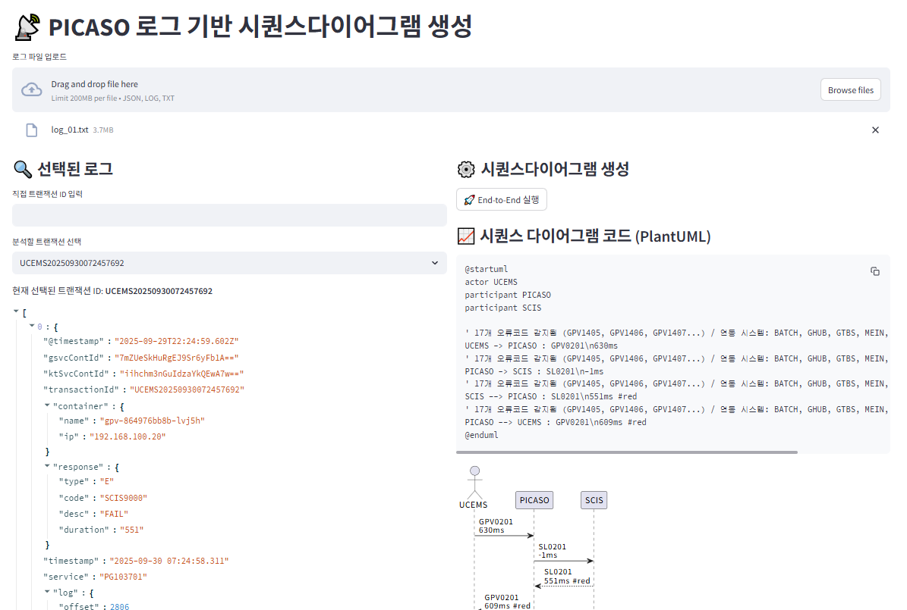

# PICASO-Trace2UML
MS AI 과제

> 트랜잭션ID/코릴레이션ID 기반 호출 로그/트레이스에서 단계·시스템 라벨을 자동 추출하여 PlantUML/Mermaid 시퀀스 다이어그램을 생성하고, 실패 지점/대안흐름(재시도·타임아웃 등)을 시각화한다. 실서비스 연동 없이 샘플/추출 로그만으로 동작하는 파일럿이다.
> - 시스템 호출 로그 기반 시퀀스다이어그램 자동생성   
> - 온보딩/분석 가시성 제고   

---

## 서비스 목표 및 범위

* 목표 : 개발 검증 시 초기 분석과 동일하게 개발되었는지 확인하고, 관리되지 않는 시스템 자료에 대해 쉽게 현행화 자료 생성을 목표로 함.
* 범위 : Skylife/HCN 가입·조회 플로우 중 1~2개 대표 시나리오.   
API GW/WAS 로그(또는 OpenTelemetry 추출본) ZIP 업로드 → 단일 페이지 UI에서 다이어그램 생성/내보내기.
* 비범위 : 실시간 스트리밍, 전체 모니터링 대체, 모든 시스템 포괄 자동화.

---

## 문제정의
| 문제 | 상세 설명 |
|------|-----------|
|복잡한 서비스 흐름|서비스 가입의 경우 kt 미디어플랫폼 시스템의 주요 시스템 6종을 연동하여 하나의 결과값을 리턴하는 것으로, 프로비저닝까지 하고 있어 전체적인 서비스 흐름은 한 눈에 파악하기 어려움|
|현행화 괸리|잦은 변화에 따른...|

---

## 아키텍처
```plaintext
[사용자] ──(브라우저)──> [Trace2UML Web UI]
                            └── 업로드: ZIP(logs) / JSON(trace)
                                │
                                ▼
                        [FastAPI 백엔드]
                ┌────────────┬───────────────┬─────────────┐
                │ Parser     │ Correlator    │ Enricher    │
                └─────┬──────┴─────┬─────────┴─────┬───────┘
                      ▼            ▼               ▼
                [Event Bus] → [Step Builder] → [LLM Labeler]
                                             │      │
                                             │      └→ [RAG KB]
                                             ▼
                                    [Diagram Builder]
                            (PlantUML/Mermaid 템플릿)
                                             ▼
                                    [Renderer/Exporter]
                            (PNG/SVG/MD, Confluence Export)

```

---

### 구성요소
Web UI (React/Vite): 파일 업로드, 코릴레이션 선택, 다이어그램 미리보기/토글(성공/실패/대안흐름), 내보내기.   
FastAPI 백엔드 (Python): 파서/정규화/스텝·패턴 추출/LLM 호출/다이어그램 생성 API.   
RAG KB (FAISS/In-memory): 시스템 명세/엔드포인트 정의/에러 사전/용어집 임베딩.   
Renderer: PlantUML CLI(내장 jar) 또는 Mermaid CLI(선택) 헤드리스 변환.   
~~Storage(파일럿): ephemeral 로컬(컨테이너 볼륨). PII 마스킹 후만 저장.~~


---

## 입력데이터 & 마스킹
### 입력 포맷(샘플 허용)
* API GW Access Log: NGINX/Envoy 포맷(+ X-Correlation-Id)   
* WAS App Log (JSON): timestamp, level, traceId, spanId, service, endpoint, status, latencyMs, error   
* OpenTelemetry(선택): traceId, spanId, parentSpanId, attributes{peer.service, http.method, http.route, status}
### 마스킹 규칙(파일럿)
~~* 주민/전화/계약ID: 포맷보존 토큰화(FPE) 또는 해시+솔트(sha256(id+salt)[:10]).~~   
~~* 주소: 시/군/구까지 유지, 상세주소 토큰화.   
Payload: 바디 전체 저장 금지, 필드명·길이·타입 메타만 유지.~~

---
## 처리파이프라인
* Parsing: 포맷 감지(정규식/JSON), 필드 추출, 시간 파싱+타임스큐 보정.   
* Correlation: corr_id|trace_id 기준 그룹핑, 누락 시 휴리스틱(동일 TCP/5초 창·IP·UA)을 보조.   
* Normalization: 상기 스키마로 맵핑, 내부/파트너 명칭 매핑 테이블 적용.   
* Patterning: 리트라이/백오프(지수 간격), 타임아웃(504/TimeoutException), Circuit Open, Partial Success 감지.   
* Step Builder: 동일 Actor→Target, 동일 엔드포인트 호출을 단일 Step으로 압축(요약: 평균·P95 지연, 시도 횟수).   
* LLM Labeling: Step 요약문/의도 라벨(예: "가입자 정보 검증", "주소 정합성 체크") 생성.   
* Diagram Builder: 템플릿에 Actor/Step/노트/P95 지연 삽입.   
Render/Export: PlantUML/Mermaid → PNG/SVG, MD/Confluence 내보내기.

---
## RAG 지식베이스(??)
* 컨텐츠 소스(샘플): 내부 시스템 설명 1p 요약, 엔드포인트 정의표, 에러코드 사전, 용어집.
* 임베딩 단위: 300~600 토큰 청크, 메타(system, endpoint, error_code).
* 질의 유형:
    * "/address/validate 는 무슨 역할?" → 라벨링 근거   
    * "GPV-9001 에러는?" → 실패 노트 텍스트

---
## UI/UX 초안 (streamlit)
* 상단: 파일 업로드(드래그&드롭) → 데이터셋 선택
* 좌측: 코릴레이션ID 리스트(검색/정렬: 시간, 실패 유무)
* 중앙: 다이어그램 미리보기(탭: 성공/실패/~~대안흐름~~)
* 우측: Step 패널(라벨·요약·p95·재시도·근거 링크)
* 하단: [Export PNG] [Export SVG] [Copy PlantUML]

<!-- 링크1 [네이버](http://www.naver.com)   
 -->
